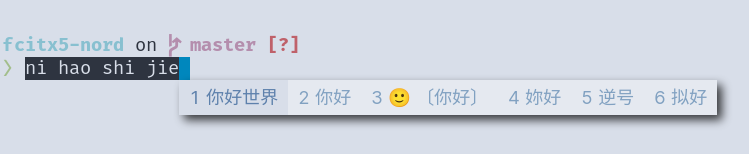
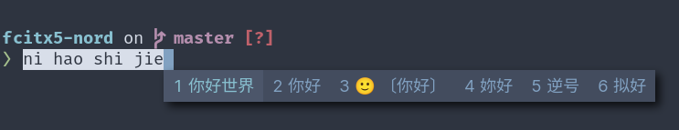

# fcitx5-nord

Fcitx5 theme based on Nord color.

## Screenshot





## Usage

### Installation

```sh
git clone https://github.com/tonyfettes/fcitx5-nord.git
mkdir -p ~/.local/share/fcitx5/themes/
cd fcitx5-nord
cp -r nord-dark/ nord-light/ ~/.local/share/fcitx5/themes/
```

### Enabling

In `~/.config/fcitx5/conf/classicui.conf`, change the `Theme` line as

```dosini
Theme=Nord-Dark
# or
Theme=Nord-Light
```

Then restart fcitx5 to apply the theme.

```sh
fcitx5 -r
```
